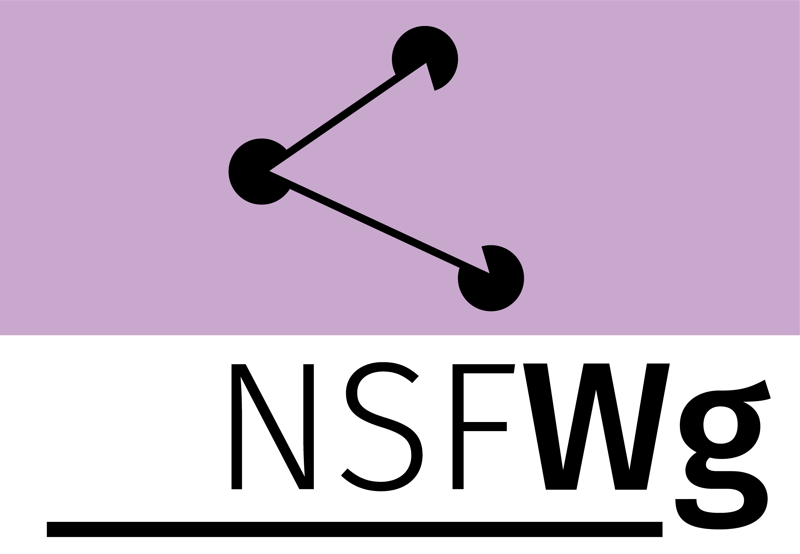

# NSFWg

このサイトは次世代ソーシャルメディア枠組ワーキンググループ (NSFWg; Next-generation Social-media Frameworks Working Group) のホームページです。

このワーキンググループでは，次世代の SNS に向けた基礎研究，研究開発や調査などを行います。

## 目標

**メディアの大統一：メディアを一般化/抽象化して統一すること。**

## 過去の研究成果

@metastable-void:

- 公衆電話用 Twitter クライアント
- リアルタイムテキスト会話アプリ (Chatspace)

------

Copyright &copy; 2022 Menhera.org. Licensed under CC-BY 4.0.
